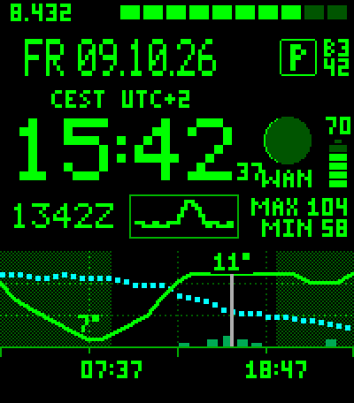
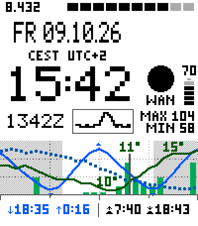
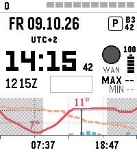
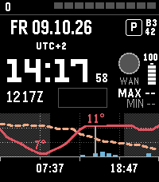
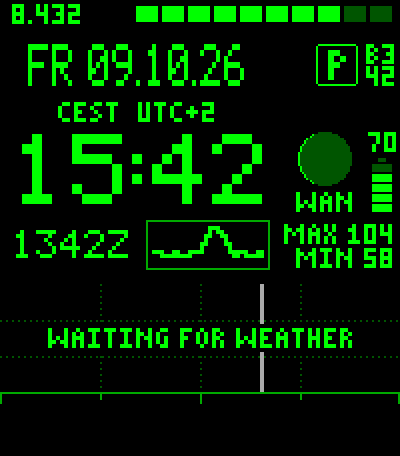
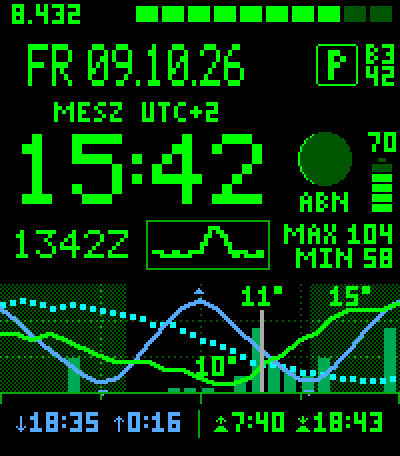
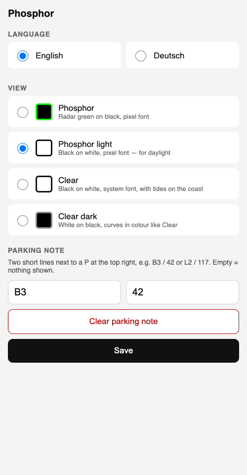

# Phosphor — watchface for Pebble Time 2

Everything at a glance: local time, UTC, date and time zone, moon phase, battery, steps, heart rate of the last
six hours — and a 24-hour strip with temperature, rain and pressure, sunrise and sunset, and tides on the coast.

Made by **Seb & Claude** (Anthropic): ideas, design and testing by Seb, code and documentation by Claude.

> **Status: beta, version 0.24.** Tested in the emery emulator, with a pixel-exact preview on the Mac and Node
> tests against live data — not yet proven in daily use. Version numbers start with 0 until it has.

<p>
  
  
  
  
</p>

*Phosphor with weather and a parking note · Phosphor light on the coast, with tides in the footer · Clear and
Clear dark with seconds running after a flick of the wrist.*

## Features

- **Four views:** Phosphor (radar green on black, pixel font), Phosphor light (black on white), Clear (system
  font on white) and Clear dark (white on black, curves in colour)
- **UTC line** (`1342Z`) and the time zone with its offset (`CEST UTC+2`) — handy when you travel or work in UTC
- **24-hour weather strip** from [Open-Meteo](https://open-meteo.com): temperature, rain per hour, pressure trend,
  night shaded, a line for *now*. Fetched once an hour, kept on the watch when the phone is away. If an update is
  due and there is no connection, the watch retries every minute, so fresh data arrives right after you are back online
- **Tides** near the coast (Open-Meteo Marine): next high and low water in the footer
- **Moon phase** drawn as a sphere, `WAX` / `WAN` below. Full and new moon stay distinguishable in every view
- **Seconds on demand:** a flick of the wrist shows them for 15 seconds, then the watch goes back to
  minute updates to save battery
- **Parking note:** a small `P` with two short lines (`B3` / `42`) at the top right — set it on the phone, clear it
  with one button and it disappears
- **No weather yet?** The chart stays, with a short note why: `WAITING FOR WEATHER`, `NO INTERNET`,
  `NO LOCATION` or `NO PHONE`
- **English** (default) or **German**

<p>
  
  
</p>

*Before the first weather update · German: `DO`, `MESZ`, `ABN`.*

## Install

1. Download `phosphor.pbw` from the [latest release](../../releases)
2. Open it on your phone with the Pebble app — it installs on the watch
3. Allow location (for weather) and health (steps, heart rate) when asked

Pebble Time 2 (emery) only.

## Settings

Pebble app → Phosphor → settings: language, view, parking note.

<p></p>

## Building

Pebble SDK 4.x (`pebble` tool). Code comments are in German.

```bash
tools/bauen.sh          # build (outside the source folder)
tools/bauen.sh emu      # build + emery emulator
tools/vorschau/rendern.sh out.png   # pixel-exact preview of the Phosphor views without the SDK
node tools/test/logik_test.js       # weather, sun and tide logic against live data
```

`tools/schrift_erzeugen.py` builds the pixel font.

## Data and credits

- Weather and tides: [Open-Meteo](https://open-meteo.com), CC BY 4.0
- Airports for the location anchor: [OurAirports](https://ourairports.com), public domain
- Sunrise, sunset and moon phase are computed locally

## License

MIT, see [LICENSE](LICENSE).
